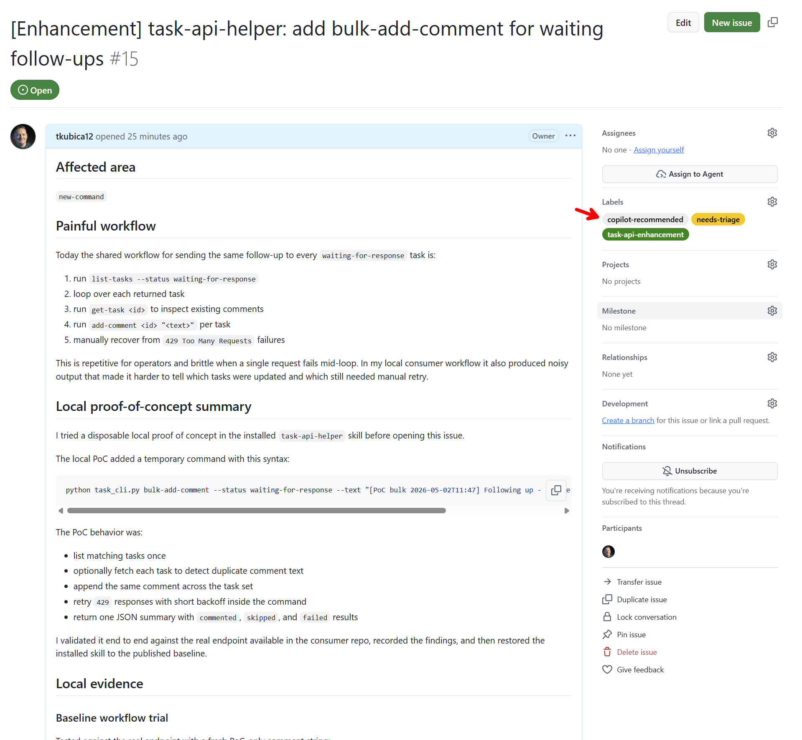
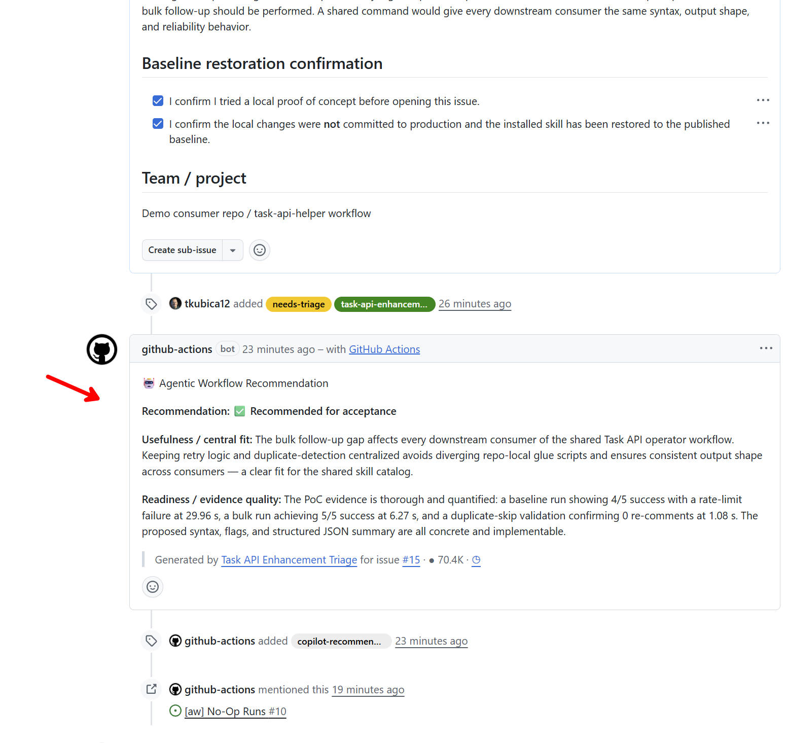
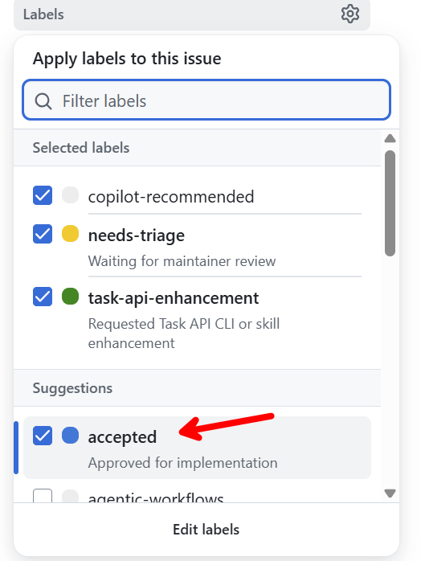
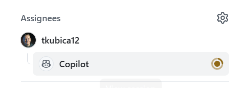
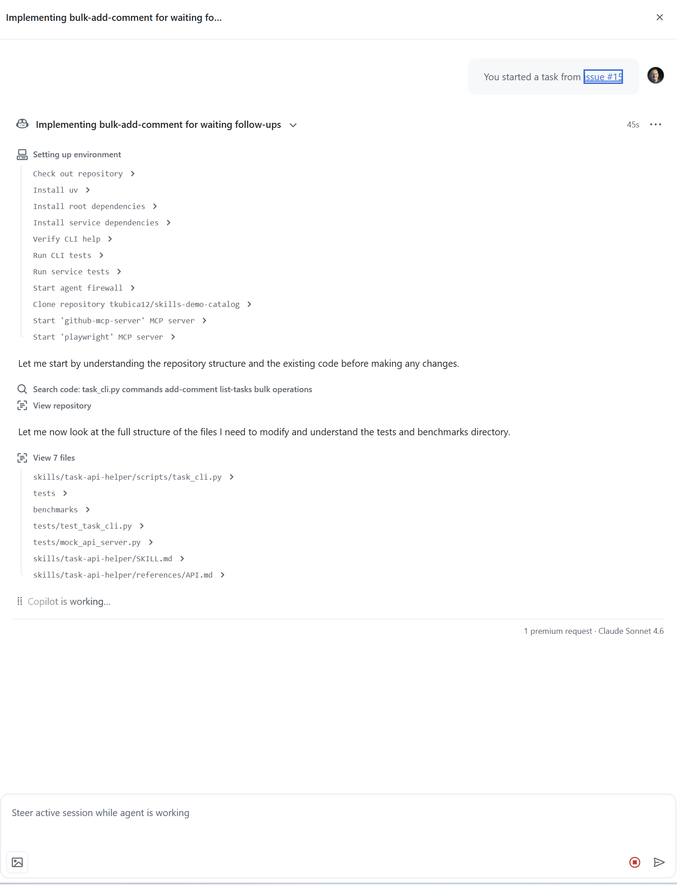
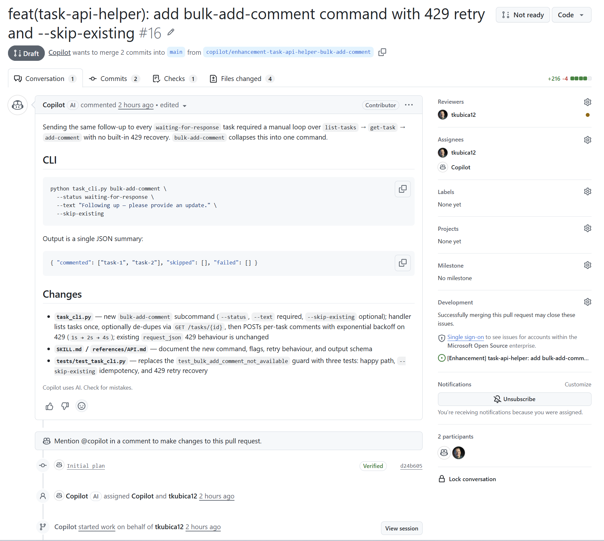
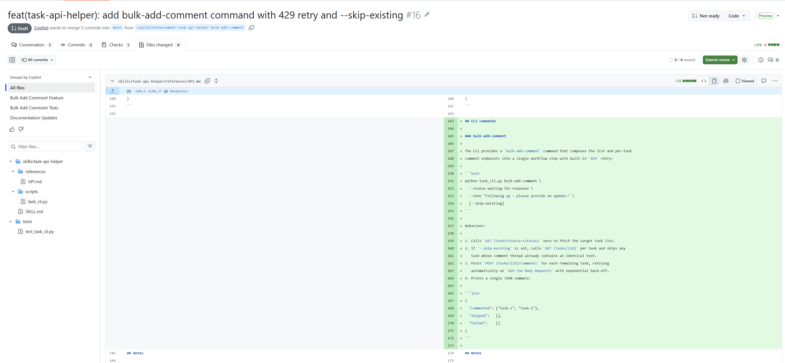
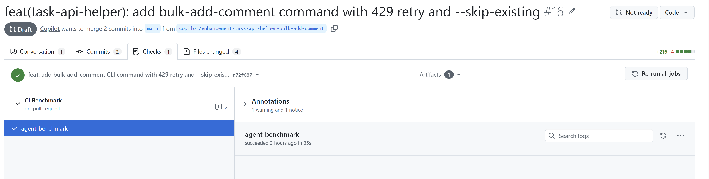
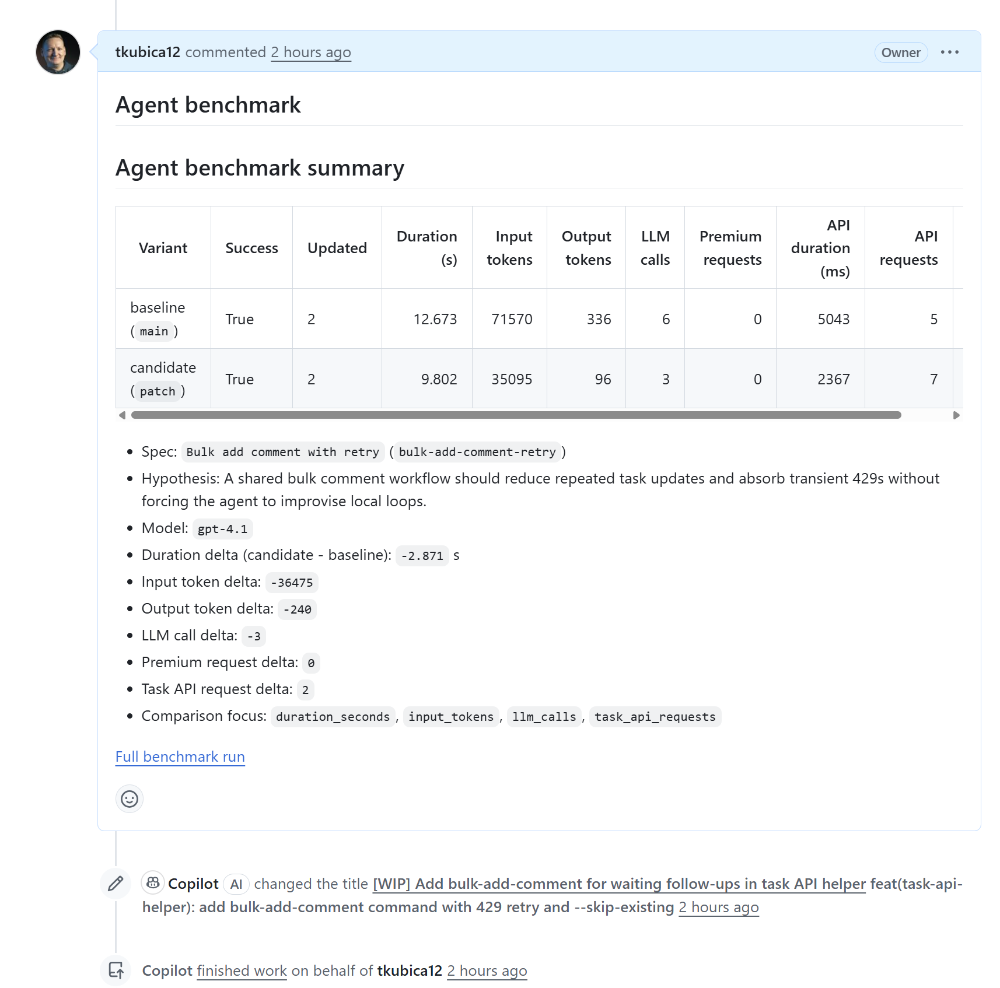

Skills pro agenty excelují hlavně jednoduchostí a jedna z mých nejoblíbenějších variant je skill přinášející vlastní CLI. Beru to tak, že agentovi lze dát přístup k nějakému API. To je ale potřeba mu vysvětlit (co to API dělá, ale i pár tipů kdy jak API použít, tedy dodat mu nějaký byznys kontext - když potřebujeme tohle, tak je dobré zavolat tohleto a pak tamto) a aby naše vysvětlení nesedělo v kontextu pokaždé, tak ho přeneseme do skillu a agent si ho přečte až když bude mít pocit, že to je potřeba. Jenže při používání toho API ale agent často udělá chybu - například si pro to montuje curl a escapování JSON requestů často pomotá a musí se opravovat. Nebo jsou třeba API, kde při změně objektu (PUT operace) nestačí dát jen nějaký merge formát, ale celý objekt, takže bych měl nejdřív udělat GET, výsledný JSON si upravit a poslat ho jako PUT a to jsou tři volání nástroje, tři přemýšlení, tokeny, latence, potenciál pro chybu.

Typicky si tedy s agentem řekneme, že pro to napíše vlastní CLI - to přiložíme ke skillu a ten už nemluví o čistém API, ale o CLI, což je levnější, rychlejší, spolehlivější. No a jak čas postupuje začínáme zjišťovat, že některé operace skládající se z mnoha API volání jsou často opakované - například smazat všechny záznamy, které jsou starší než měsíc. API často tohle přímo neumí, takže agent musí nejdřív záznamy najít a pak jeden po druhém zavolat DELETE - opět pomalé a tokeny žeroucí věci, takže zjistíme, že by bylo dobré tohle přidat do CLI a agent to příště vyřeší jedním příkazem. Agent tak dokáže sám sebe zlepšovat. Shrnuto typická evoluce skillu nad API u mě je:

1. Skill jako kontext - markdown vysvětlující API a business kontext jak ho používat
2. Přidání CLI, protože je to pro agenta potom rychlejší, spolehlivější a levnější
3. Jak jde čas zjišťuje se, že některé vícekrokové operace jsou časté a dává smysl takovou logiku do CLI přidat - řešit ji kódem, ne agentem, to je škoda tokenů

Tohle všechno je fajn a samorozvíjení skillu agentem na základě reálné zkušenosti s jeho používáním je výborný koncept, ale funguje u mě na notebooku. Co když je to skill pro celý tým nebo firmu? **Jak umožnit agentům samostatný rozvoj, ale přitom to řešit centrálně?** Tak přesně na to se dnes podívám. Existuje totiž něco co umožňuje cloudové kódování a řízení změn - jasně, je to **GitHub**.

# Skill a API
Pro účely dema jsem si vyrobil API pro správu tasků a připravil skill task-api-helper, který obsahuje jednak textové instrukce ([SKILL.md](https://github.com/tkubica12/skills-demo-catalog/blob/main/skills/task-api-helper/SKILL.md)), dále vlastní CLI ([task_cli.py](https://github.com/tkubica12/skills-demo-catalog/blob/main/skills/task-api-helper/scripts/task_cli.py)), popis API ([API.md](https://github.com/tkubica12/skills-demo-catalog/blob/main/skills/task-api-helper/references/API.md)) pro případ, že by CLI něco neumělo a porozumění podkladového API by bylo potřeba no a hlavně také instrukce jak tento skill modifikovat: [IMPROVEMENT-PROCESS.md](https://github.com/tkubica12/skills-demo-catalog/blob/main/skills/task-api-helper/references/IMPROVEMENT-PROCESS.md). 

1. **Local experiment**  
   A consumer team tries a temporary local proof of concept in the current repository and validates it against the real workflow that exposed the gap.
2. **Benchmark**  
   The team captures before/after evidence from that local trial — timing data when relevant, but also reliability improvements, fewer retries, fewer manual steps, or cleaner behavior.
3. **Issue with template**  
    The team restores the local changes to the published baseline, then opens an issue with `.github/ISSUE_TEMPLATE/task-api-enhancement.yml` and includes the local proof-of-concept evidence.
4. **Advisory triage**  
   A GitHub Agentic Workflow can add an early recommendation comment and an advisory label such as `copilot-recommended`, but this does not replace human maintainer review. In this repo that workflow is backed by gh-aw and needs `COPILOT_GITHUB_TOKEN` configured in Actions.
5. **Triage**  
   Catalog maintainers review the problem statement, the measured pain, the proposed command syntax, and whether the shared API or CLI contract should change.
6. **Copilot or cloud agent implementation**  
   Once accepted, Copilot or the configured cloud agent implements the change in the central catalog and authors a benchmark spec describing the workflow benefit to measure.
7. **Pull request**  
   The PR updates `task_cli.py`, `API.md`, `SKILL.md`, tests, the benchmark spec, and benchmark evidence.
8. **Catalog release**  
   After merge, the catalog is tagged and released.
9. **Consumer update**  
   Consumer repositories update their installed skill version and stop carrying any local fork.


V repozitáři jsou skilly uloženy v adresáři skills (pozor, ne .agents nebo .github, protože tohle je katalog) a díky tomu fungují se standardním katalogem skillů, v mém případě budu používat příkaz **gh skill**, který se namíří na katalog a umožňuje stahovat skilly do mého projektu a to včetně verzování přes GitHub Releases (Git tagy).

API má schválně udělané chyby a s pravděpodobností 30 % vrací 429 a je potřeba dělat retry. Nic z toho v CLI není implementované a je to určitě dobrý kandidát na případné vylepšení, ale nepředbíhejme.

# Nainstalujeme skill, používáme

V novém adresáři tedy nainstaluji skill příkazem

```bash
gh skill install tkubica12/skills-demo-catalog task-api-helper --scope project --agent github-copilot
```

Následně spustím GitHub Copilot CLI a zkusíme pár dotazů.

```markdown
> List tasks waiting for response and summarize what needs attention.

● The Task API is responding, but the first request hit a rate limit. I’m checking the response shape and then retrying with a short pause so I can give you the actual waiting items instead of a guess.

● 5 tasks are waiting for response. The ones needing the most attention are the two high-priority items stalled on external confirmation or approval.

  ┌──────────────────────────────────────────────────────────────────┬──────────┬───────────────────┬────────────────────────────────────────────────────────────────────────────────────────────────────────────────────────┐
  │ Task                                                             │ Priority │ Assignee          │ Needs attention                                                                                                        │
  ├──────────────────────────────────────────────────────────────────┼──────────┼───────────────────┼────────────────────────────────────────────────────────────────────────────────────────────────────────────────────────┤
  │ task-1 — Waiting on customer confirmation — order #8821          │ High     │ alice@example.com │ Customer still has not confirmed after the initial outreach and a 48-hour follow-up.                                   │
  ├──────────────────────────────────────────────────────────────────┼──────────┼───────────────────┼────────────────────────────────────────────────────────────────────────────────────────────────────────────────────────┤
  │ task-3 — Awaiting legal sign-off on NDA amendment                │ High     │ carol@example.com │ Legal review is pending after the NDA draft was forwarded.                                                             │
  ├──────────────────────────────────────────────────────────────────┼──────────┼───────────────────┼────────────────────────────────────────────────────────────────────────────────────────────────────────────────────────┤
  │ task-2 — Pending vendor reply for Q3 renewal                     │ Medium   │ bob@example.com   │ Vendor has not replied since the renewal quote was sent.                                                               │
  ├──────────────────────────────────────────────────────────────────┼──────────┼───────────────────┼────────────────────────────────────────────────────────────────────────────────────────────────────────────────────────┤
  │ task-5 — Infrastructure cost review — ops team response needed   │ Medium   │ eve@example.com   │ Ops response is pending, and there is no comment history, so this likely needs owner context or a first follow-up.     │
  ├──────────────────────────────────────────────────────────────────┼──────────┼───────────────────┼────────────────────────────────────────────────────────────────────────────────────────────────────────────────────────┤
  │ task-4 — Customer reported login failure — needs repro steps     │ Low      │ dave@example.com  │ Blocked waiting for the customer to provide reproduction steps.                                                        │
  └──────────────────────────────────────────────────────────────────┴──────────┴───────────────────┴────────────────────────────────────────────────────────────────────────────────────────────────────────────────────────┘

> Open task-1 and add this comment: "Following up - please provide an update."

● Added the comment to task-1. The API accepted it as comment c-c0d260d5.

> Add the same comment to every task waiting for response. 

● The bulk run hit rate limits mid-stream. I’m reading the exact output and then I’ll finish only the tasks that didn’t get updated.
● task-5 was the only one not updated. I’m retrying that single task with a slower cadence to get it through cleanly.
● Done. The comment was added to all other tasks currently in waiting-for-response, and task-1 was skipped because it already had the same comment.

  Updated:

   - task-2 → c-c6739b09
   - task-3 → c-7d3bbfb3
   - task-4 → c-0b008411
   - task-5 → c-2d311712
```

# Agente, dalo by se něco zlepšit?
Myslím, že pokud je tohle něco častého, dávalo by smysl skill vylepšit - v tomto případě nejen nějakou kontextovou poznámkou, ale přímo rozšířením našeho CLI.

```markdown
> Based on your experience with this workflow, suggest improvement that could make it faster or more reliable next time.

● Best improvement: add a first-class bulk command to the shared CLI, for example:

   python task_cli.py bulk-add-comment --status waiting-for-response --text "Following up - please provide an update." --skip-existing

  That would help because this workflow currently requires list → get each task → detect duplicates → post comment, which is slow and exposed to 429 rate limits. A bulk command could make it both faster and more reliable by handling:

   - built-in retry/backoff for rate limits
   - duplicate-comment detection (--skip-existing)
   - a single summary of which tasks were updated or skipped

  Per the skill’s process, the right next step would be a local proof of concept that captures before/after evidence: fewer API calls, fewer retries, and cleaner operator output.
```

Dobrý nápad. Pojďme tohle tedy implementovat. Dle instrukcí by měl tento agent nejprve tenhle nápad vyzkoušet a pokud mu to bude fungovat, tak své závěry a testy detailně popsat do Issue, které založí v repozitáři skills-demo-catalog. Tedy agent, který udělal nějakou zkušenost, si udělá PoC, ať má jistotu že to dává smysl, ale sám kód do centrálního skillu dávat nesmí. Skvěle to popíše, ale tím to pro něj končí.

```markdown
> OK, this make sense. Follow improvement guide, test this idea locally as PoC and if it is good, publish this is detailed issue into skills-demo-catalog repository.

● I’m setting up a proper local PoC in the installed skill, capturing before/after evidence, and then I’ll revert the local patch before opening the upstream issue if the results hold.
● I’m capturing a concrete baseline with a fresh PoC-only comment string so the comparison uses the same live workflow the improvement is meant to simplify.
● I’ve got a clean baseline: 11 calls over ~30s, one 429, and only 4 of 5 tasks updated. I’m turning that into a disposable bulk command with internal 429 handling so we can see whether it actually fixes the failure mode.
● The first PoC run worked cleanly: all 5 tasks updated in about 6 seconds with no failures. I’m doing one repeat run with the same text to prove the --skip-existing behavior too, since that’s part of the proposed workflow.
● I’ve got enough evidence now: the PoC fixed the partial-failure case and validated duplicate skipping. I’m writing the findings down, restoring the installed skill to the published baseline, and then I’ll open the upstream issue from that evidence.
● I’ve drafted the issue in the repo’s enhancement format and I’m publishing it now with the expected labels so maintainers get the PoC evidence, not just the idea.
● Done. I ran a disposable local PoC, recorded the results, restored the installed skill to baseline, and published the upstream issue here:

  https://github.com/tkubica12/skills-demo-catalog/issues/15

  The PoC was good enough to justify the issue: the baseline loop updated 4/5 tasks in 29.96s with 1 rate-limit failure, while the temporary bulk-add-comment command updated 5/5 tasks in 6.27s with 0 failures and correctly skipped duplicates on a repeat run.
```

# Automatická triáž s Agentic Workflows v GitHub Actions
Založené Issue je automaticky prozkoumáno agentem v pipeline, což je díky **GitHub Agentic Workflows** velmi snadné a předpis najdete zde: [task-api-enhancement-triage.md](https://github.com/tkubica12/skills-demo-catalog/blob/main/.github/workflows/task-api-enhancement-triage.md). Agent si Issue přečte, posoudí to a poznámku k tomu issue připojí. Pokud dojde k závěru, že se mu to líbí a doporučuje to, přidá k issue label **copilot-recommended**.

Podívejte jak pěkné a komplexní Issue to je a agent nám jeho schválení doporučuje.

[{:class="img-fluid"}](images/2026-05-02-12-13-01.png)

No a k němu máme komentář našeho triage agenta.

[{:class="img-fluid"}](images/2026-05-02-12-13-48.png)

To zní skvěle, beru! Mám to nastavené tak, že tohle je lidský krok - co se mi líbí tak přijmu tím, že u Issue přiřadím label **accepted**.

[{:class="img-fluid"}](images/2026-05-02-12-22-20.png)

# Agentické nakódování, agentické testování
Mám připravené workflow tak, že jakmile se objeví na Issue label **accepted**, tak je toto přiřazeno Copilotovi v cloudu, který na tom začne makat.

[{:class="img-fluid"}](images/2026-05-02-12-23-31.png)

[{:class="img-fluid"}](images/2026-05-02-12-23-52.png)

Mohl bych to sledovat a steerovat ho v průběhu, ale to já nechci - ať to celé připraví. Výsledkem by mělo být, že vznikne kompletní Pull Request s návrhem změny a to se po chvilce skutečně stalo.

[{:class="img-fluid"}](images/2026-05-02-14-31-15.png)

[{:class="img-fluid"}](images/2026-05-02-14-31-55.png)

Jenže já chci jít dál - chci, aby se skutečně prokázalo, že to vylepšení dává smysl a dobrý způsob jak to zjistit je vědět **o kolik tokenů** méně spotřebuje kódovací agent když má novou verzi skillu a také **o kolik mu to jde rychleji**. Udělal jsem to tak, že v pipeline je automatický check - říkám tomu **agent-benchmark** a je tady: [ci-benchmark.yml](https://github.com/tkubica12/skills-demo-catalog/blob/main/.github/workflows/ci-benchmark.yml). Je to skript, který vezme příklad použití nové funkce skillu ve formě promptu (to má od kódovacího kolegy) a přes GitHub Copilot SDK nastartuje agentický běh. Jednou z předchozí verzí skillu z mainu a jednou s novou verzí, která je v Pull Requestu. Identická verze GitHub Copilot SDK i promptu, rozdíl je jen ve skillu a změříme výsledek v počtu tokenů a času. Tenhle se zapíše jako komentář do Pull Requestu, takže při schvalování je to další informace pro člověka, který se rozhoduje zda to přijmout.

[{:class="img-fluid"}](images/2026-05-02-14-32-31.png)

[{:class="img-fluid"}](images/2026-05-02-14-33-02.png)

# Shrnutí a co si vyzkoušet
- Používejte **gh skills** pro správu skillů a jejich verzování v centrálním repozitáři
- Přidejte ke skillu informaci jakým procesem ho může agent **vylepšit** - process, PoC, Issue template
- Využívejte GitHub Actions pro automatizaci práce s využitím **label**
- Vyzkoušejte **GitHub Agentic Workflows** - výborný způsob jak mít v pipeline agenty bez složitého skriptování, třeba pro triáž, dokumentaci, chytřejší nasazování, agentické testování apod.
- Používejte GitHub Copilot **cloud agenta** pro přetavení Issue na kód a Pull Request
- Agenty můžete startovat sami programaticky a měřit si tak kvalitu skillu, **GitHub Copilot CLI nebo SDK** lze spouštět přímo z pipeline
- Prohlédně si to celé u mě na [GitHubu](https://github.com/tkubica12/skills-demo-catalog)